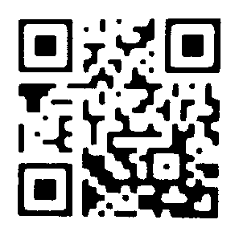

# OutOfFocusQRReader

OutOfFocusQRReader is a library for reading QR Code from out-of-focus images on Android.

This library uses the OpenCV library.

*“QR Code” is a registered trademark of DENSO WAVE INCORPORATED.*

# Install

## Download OpenCV

Download the latest version of the OpenCV Android library from the official OpenCV web page.

https://opencv.org/releases/

## Extract zip and move SDK folder

Extract the files the downloaded zip file and move the SDK folder to your project root folder.

## Install OpenCV SDK

Edit the `settings.gradle` file in your project and sync your project:

```gradle
// add
include ':sdk'
```

## Install OutOfFocusQRReader

Edit the `build.gradle` file in your project:

```gradle
repositories {
    mavenCentral()
}

dependencies {
    // OpenCV sdk
    implementation project(':sdk')

    // core
    implementation 'com.github.soranakk.oofqrreader:oofqrreader:1.0.0'
}
```

# Usage

## Create ImageData

### Example using Camera2API

```gradle
dependencies {
    ...

    implementation 'com.github.soranakk.oofqrreader:image-converter-android-camera:1.0.0'
}
```

```kotlin
val imageConverter = Camera2ApiImageConverter()
ImageReader.newInstance(width, height, ImageFormat.YUV_420_888, 1)
    .apply {
        setOnImageAvailableListener({ reader ->
            reader?.acquireLatestImage()?.let { image ->
                val imageData = imageConverter.convertImage(image)
                ... read QR Code
                image.close()
            }
        }, workerHandler)
```

### Example using CameraXAPI

```gradle
dependencies {
    ...

    implementation 'com.github.soranakk.oofqrreader:image-converter-androidx-camera:1.0.0'
}
```

```kotlin
val imageConverter = CameraXApiImageConverter()
val imageAnalysis = ImageAnalysis.Builder()
  .setTargetRotation(Surface.ROTATION_0)
  .setTargetResolution(Size(1280, 720))
  .setBackpressureStrategy(ImageAnalysis.STRATEGY_KEEP_ONLY_LATEST)
  .build()
  .also {
      it.setAnalyzer(cameraExecutor, ImageAnalysis.Analyzer { image ->
          val imageData = imageConverter.convertImage(image)
          ... read QR Code
          image.close()
      })
  }
```

## Create QRCodeDecoder

### Example using [MLKit](https://developers.google.com/ml-kit/vision/barcode-scanning/android):

```gradle
dependencies {
    ...

    implementation 'com.github.soranakk.oofqrreader:decoder-mlkit:1.0.0'
    implementation 'com.google.mlkit:barcode-scanning:16.1.1'
}
```

```kotlin
val mlKitDecoder = MLKitDecoder()
```

### Example using [ZXing](https://github.com/zxing/zxing):

```gradle
dependencies {
    ...

    implementation 'com.github.soranakk.oofqrreader:decoder-zxing:1.0.0'
    implementation "com.google.zxing:core:3.4.1"
}
```

```kotlin
val zxingDecoder = ZxingDecoder()
```

If your app require Android minSdkVersion less than 24,
see https://github.com/zxing/zxing/issues/1170 and demoApp's build.gradle

### Example using [OpenCV](https://opencv.org/):

```gradle
dependencies {
    ...

    implementation 'com.github.soranakk.oofqrreader:decoder-opencv:1.0.0'
}
```

```kotlin
val openCVDecoder = OpenCVDecoder()
```

## Read QR code

```kotlin
val qrReader = MultiFilterQRCodeReader(someDecoder)
val result = qrReader.detectAndRead(image)
```

See demoApp for more info.

# Appendix

## How to improve accuracy

### Estimate the area where a QR code exist

Estimate the area where a QR code exists by using the large contrast between the QR code and the background.

1. Make the input image grayscale
2. Binarize with Otsu's method
3. Use `Imgproc.erode` to thicken the dots in a QR code and turn them into black squares.
4. Use `Imgproc.findContours` to get the black square area

### Adjust the image

Further improve the accuracy by processing the image of the estimated area using various Image Filters.
The features of each ImageFilter implemented are as follows.

#### GaussianThresholdFilter

Binarize with a weighted average using Gaussian as a threshold at a fixed block size.

Input image


Estimate the area where a QR code exists


After applying the image filter


#### ThresholdOtsuFilter

Binarize Otsu's method.

Input image


Estimate the area where a QR code exists


After applying the image filter



#### OverexposureFilter

A filter for reading overexposed QR codes by setting a threshold so that even almost white areas become black.
Most input images output a black image, but under certain circumstances this filter works well.
For example, displaying a QR code on a smartphone will result in overexposure due to the strong backlight of the smartphone.

Input image


Estimate the area where a QR code exists


After applying the image filter


